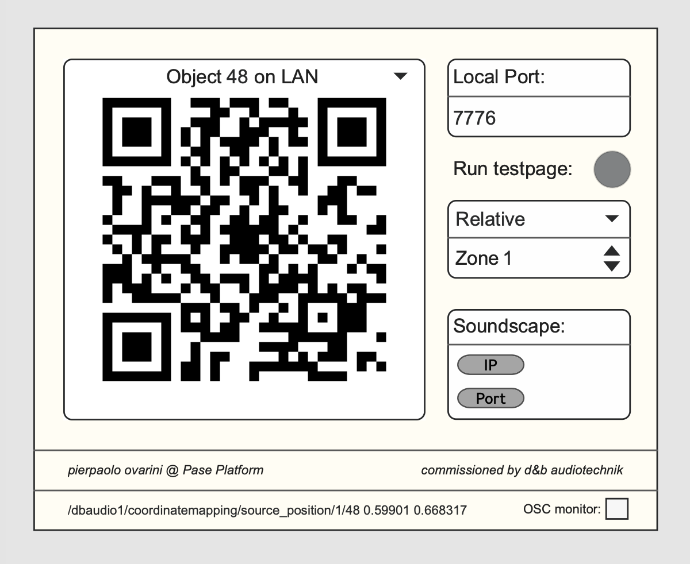
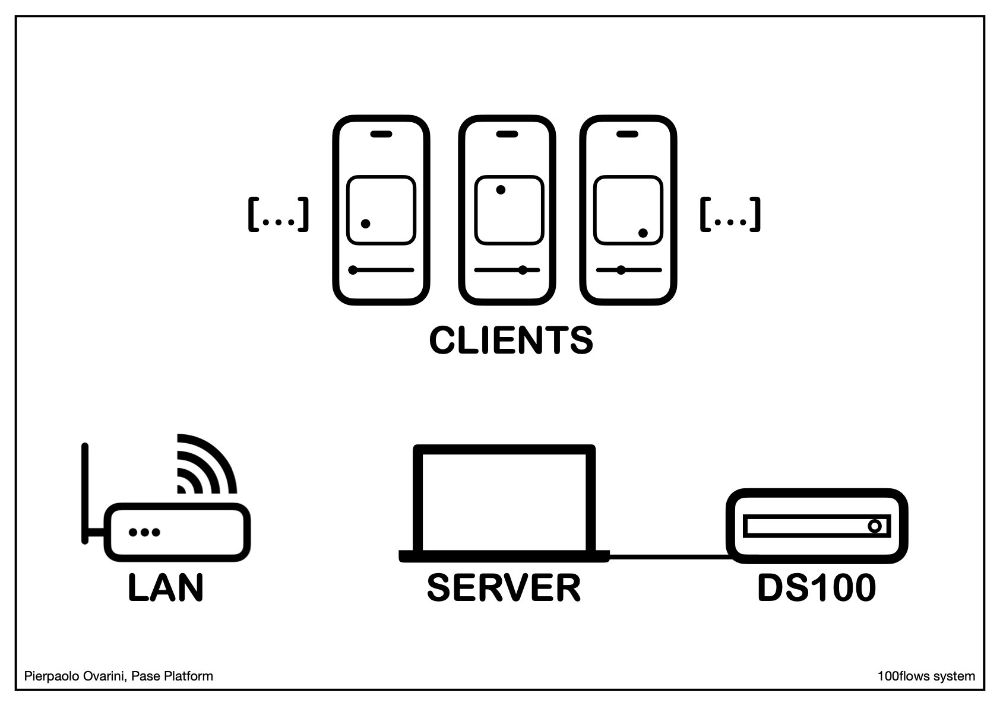
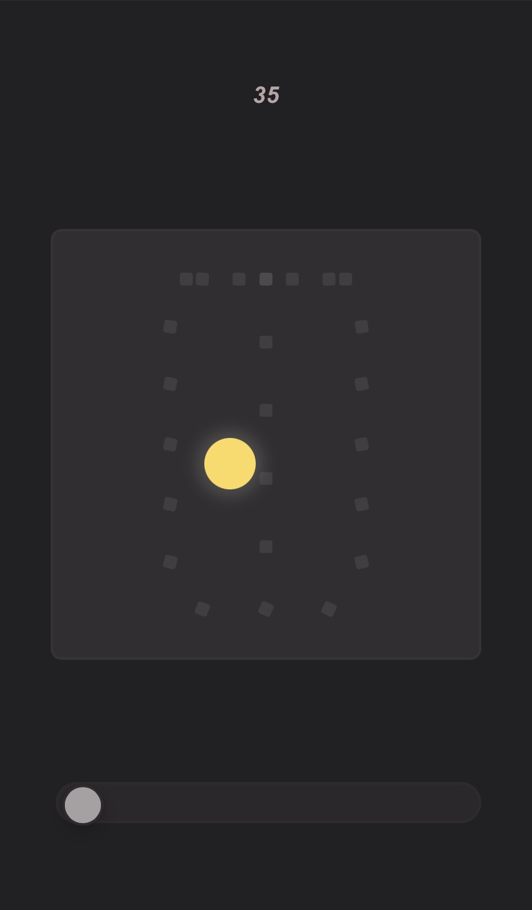

# 100flows

100flows is a Node.js-based server software that uses Max MSP to handle connections between x/y controllers generated on client web pages (reacheable with QR codes) and translate the input into OSC messages interpretable by the d&b audiotechnik DS100 hardware system. The control interfaces can be accessed via internet through tunneling systems (such as ngrok) or by setting up a Wi-Fi LAN using a router.

## Table of Contents

1. [Introduction](#introduction)
2. [Quick Setup](#quick-setup)
3. [OSC Network Setup Instructions](#osc-network-setup-instructions)
4. [LAN Network Setup Instructions](#lan-network-setup-instructions)
5. [Generating QR Codes](#generating-qr-codes)
6. [Final Setup](#final-setup)
7. [User Guide](#user-guide)
8. [Common Errors and Troubleshooting](#common-errors-and-troubleshooting)

## Introduction

100flows allows users to control spatial audio objects via web-based controllers and send their inputs to a DS100 Soundscape system. Users can access the controller interfaces by connecting to the host machine’s localhost or through a Wi-Fi LAN setup.
Note that the following steps are only needed the first time, after setting up the network connection you can just open the 100flows app.

## Quick Setup

If you want to run the software quickly withouth changing any default parameter and withouth generating new QR Codes these are the setps needed:

- Setup a Router to host a local Wi-Fi network with IP: `192.168.0.1`
- Connect your computer to the LAN you just setup and change your IP to be static on: `192.168.0.2`
- Create a network for the Soundscape connection over ethernet, the Soundscape IP is `192.168.20.99` and the port is `50010`
- Give your computer a static IP in the Soundscape Network, like: `192.168.20.50`
- Download Max from Cyclin'74 [website](https://cycling74.com/downloads) (The software is last tested on 8.6.2 version)
- Now open the "100flows_main.maxpat" file with Max (also Max Trial works)
- Select on the interface drop down menu the number of the matrix object you want to control and scan it with your smartphone
- If everything went correctly and you've done all the passages you should see the number of the object appear in the smartphone UI. Also in the "large positioning" you can see the correct object moving. Otherwise go to the [Common Errors and Troubleshooting](#common-errors-and-troubleshooting) section to check your setup.


*100flows server controller UI*
<br>

*100flows functioning scheme*
<br>

*100flows client controller UI*
<br>

If you want to manually setup the system or understand it more deeply you have all the instructions below.

## OSC Network Setup Instructions

To connect the DS100 Soundscape system to 100flows, follow these steps:

1. Connect the Soundscape system via Ethernet cable.
2. Set up an Ethernet network for sending and receiving OSC messages. By default, 100flows uses the IP address `192.168.20.99` and port `50010` for the Soundscape system. These values can be modified in the 100flows UI.

### Important Note:

Ensure that the Soundscape system and the router are on different IP addresses to avoid breaking the connection between Max MSP and the Soundscape.

## LAN Network Setup Instructions

These instructions explain how to create a local network that allows users to connect to the localhost on the main computer hosting the client controllers’ GUIs:

1. Connect to the router’s Wi-Fi (or use an Ethernet cable if necessary).
2. Access the router’s default page:
    - The address is usually found on the back of the router.
    - You can also find it using the terminal:
        - On macOS: `netstat -nr | grep default`
        - On Windows: (use command specific to Windows)
3. Configure a local LAN network.
4. Assign a static IP address to your computer within the network (e.g., if the router is on `192.168.0.1`, set your computer to `192.168.0.2`).

5. Clients must connect using the IP and port you’ve set up. For example, if the port is `7776`, the address will be `192.168.1.2:7776`, and users must append the room variable `/?room=stanza[n]` to access the correct room.
6. If the “connecting…” message disappears and the track name appears, the connection is successful, and the Soundscape system should be receiving data.

### Important Note:

The router and the Soundscape must be on different IP addresses to prevent connection conflicts between Max MSP and the Soundscape system.

### Example:

- **Router LAN IP**: `192.168.0.1`
- **Computer IP**: `192.168.0.2`
- **Hosting on port**: `7776`
- If a user wants to control Soundscape object 28 the URL is: `192.168.0.2:7776/?room=stanza28`

## Generating QR Codes

You can generate static QR codes that link to the control interfaces using a Python script. Follow these steps:

1. Download and install Python from [python.org](https://www.python.org) (if not already installed). On macOS, Python may be installed by default.
2. In the terminal, run the command:
    ```bash
    python3 QR_generator_100flows.py
    ```
3. Enter the required input data (IP and port) to generate the QR codes.

## Final Setup

To finalize the setup, follow these steps:

1. Download Max at [Cyclin'74](https://cycling74.com/downloads)
2. Open "100flows_main.maxpat" with Max and click the “testpage” button.
3. Your default browser should open with the controller and GUI interface.
4. If the message at the top remains “connecting…”, the OSC connection between 100flows and the Soundscape is not functioning (see Error 02).
5. If successful, the page will show the name of the first object in the R1 project.

## User Guide

In the main patcher UI you can edit:

- The port of the localhost hosting page on your local network
- The IP of the Soundscape system
- The port of the Soundscape system
- The QR code that you want to scan linked to the specific URL of the controller for that numbered object.
- You can choose to work both with Absolute or Relative coordinate mapping:
    - Relative: you are working with the R1 / ArrayCalc project zone system in which you can choose to make four different zones the (square) size you want. So This way you can control which part of the space is under control of the users
    - Absolute: you can change the square meters value from the origin of the project to define the area of intervention of the users

### Important Note:

if you are in relative mode you won't see the speakers in the clients screens, you must use absolute mode if you want that.

In the client UI you have:

- 2D controller to move the object in the space
- A slider that controls the reverb send gain for the specific object

## Common Errors and Troubleshooting

### Error 01: Blank Page on “Testpage”

If the “testpage” button opens a blank page, the default port may be occupied. Change the localhost port and update the address in your browser accordingly. For example:

- **Default URL**: `127.0.0.1:7776/?room=stanza1`
- If the port changes to `5555`, use the URL `127.0.0.1:5555/?room=stanza1`.

### Error 02: Stuck on “Connecting…”

If the test page displays the GUI but remains stuck on “connecting…”, try the following steps:

1. Restart the 100flows app.
2. Adjust the OSC network setup between the computer and the Soundscape (change the IP or port to ensure compatibility with the R1 software configuration).

   
### Error 03: Speaker setup not showing

If the client controller page on the phone does not show the speaker setup graphically you should try and relaunch the patch, it may be that you open patch before setting up the OSC connection with the Soundscape.

*the network starting code for this project belongs to the CidLink project of Enrico Pietrocola*
